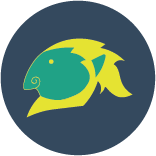

<p align="center">
  

</p>

<p align="center">
  Ganon is a javascript library designed and maintained by open source contributors.
  <br />
  <br />
  <a href="https://travis-ci.org/BlakeGuilloud/ganon">
    
  </a>
  <a href="https://www.npmjs.com/package/ganon">
    
  </a>
  <a href="https://github.com/BlakeGuilloud/ganon/blob/master/LICENS">
    
  </a>
  <a href="https://www.npmjs.org/package/ganon">
    
  </a>
</p>

<!-- [](https://travis-ci.org/BlakeGuilloud/ganon) [](https://www.npmjs.com/package/ganon) [](https://github.com/BlakeGuilloud/ganon/blob/master/LICENSE)
[](https://www.npmjs.org/package/ganon)
-->


<br />

### A HUGE THANKS!!
A very special thanks to [@csleong98](https://github.com/csleong98) for designing our logo!


Huge props to [@andreasgruenh](https://github.com/andreasgruenh) and [@ktilcu](https://github.com/ktilcu) for helping collaborate.

And the biggest of credit goes to all of our awesome [Contributors](https://github.com/BlakeGuilloud/ganon/graphs/contributors)!!

### Usage
```bash
$ yarn add ganon
```

NodeJS
```javascript
// import { sum } from 'ganon';
const { sum } = require('ganon');

const sumOfOneAndTwo = sum(1, 2);
=> 3
```

Javascript
```javascript
// import sum from 'ganon/dist/sum';
const sum = require('ganon/dist/sum');

const sumOfOneAndTwo = sum(1, 2);
=> 3
```

### Objective
To build a suite of javascript methods by the time [hacktoberfest](https://hacktoberfest.digitalocean.com/) ends! Let's get some T-shirts!!

Ganon is designed to get as many people involved as possible, so our objective here is to fix or improve an existing method and then write the skeleton of a desired method for someone else to build. In the spirit of getting everyone involved, please only fix one or two methods at a time and make sure to push up something for someone else to work on!

This project was created to have fun.

### Project Structure
All methods will live in the `lib` directory of the project. They should be written as [methodName].js, required and exported in `lib/index.js`.

All tests will live in the `test` directory. A test file should be formatted `[methodName].test.js` to reflect what method is being tested.

### Contributing
Please read our [Contributing Guide](https://github.com/BlakeGuilloud/ganon/blob/master/CONTRIBUTING.md) for information on how to contribute to this project! All skill levels are more than welcome to participate in this project!

### Demo
We're going to walk through the process of taking on an issue, resolving it, writing a new issue, and shipping some code.

The method we are going to resolve is called `sum`:

```javascript
// lib/sum.js

function sum(a, b) {
// Your code goes here.
}

module.exports = sum;
```

In order to test this method, we will first run `yarn test sum`:

```bash
$ yarn test sum

  FAIL  problems/sum.test.js
    ✕ adds 1 + 2 to equal 3 (8ms)
    ✕ adds 3 + 4 to equal 7 (1ms)

    ● adds 1 + 2 to equal 3

      expect(received).toBe(expected)

      Expected value to be (using ===):
        3
      Received:
        undefined
```

As you can see, there is something wrong with the function sum, so let's resolve it:

```javascript
// lib/sum.js

function sum(a, b) {
  return a + b;
}

module.exports = sum;
```

Run the test again:

```bash
$ yarn test sum

  PASS  problems/sum.test.js
    ✓ adds 1 + 2 to equal 3 (6ms)
    ✓ adds 3 + 4 to equal 7 (1ms)
```

Now that I have fixed the sum function to return the desired value, I need to write the skeleton of a new method for other contributors to work on. Let's write one called `difference`:

```javascript
// lib/difference.js

// Write a function that returns the difference of the first two parameters

function difference(a, b) {
// Your code goes here.
}

module.exports = difference;
```

We will need to accompany this method with a test(s) to ensure it returns the proper value:

```javascript
// test/difference.test.js

const { difference } = require("../lib");

describe("difference", () => {
  test("subtracts 1 - 3 to equal -2", () => {
    expect(difference(1, 3)).toBe(-2);
  });

  test("subtracts 10 - 3 to equal 7", () => {
    expect(difference(10, 3)).toBe(7);
  });
});

```

Now that we have fixed a method, written the skeleton of a new method, and a test to accompany it, we can push up our changes and open a pull request. :fire: :fire: :fire:
